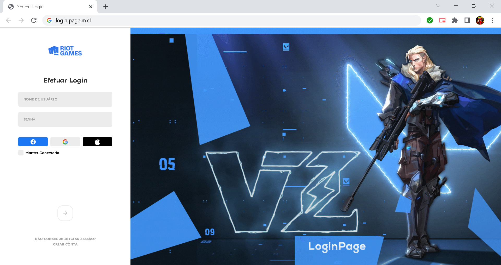

# Valorant Login Page

<!---Esses são exemplos. Veja https://shields.io para outras pessoas ou para personalizar este conjunto de escudos. Você pode querer incluir dependências, status do projeto e informações de licença aqui--->




> Uma tela de Login baseada no jogo "Valorant" para acessar um painel de estatísticas.

### Ajustes e melhorias

O projeto ainda está em desenvolvimento e as próximas atualizações serão voltadas nas seguintes tarefas:

- [x] Tela de Login
- [x] Requisitos de acesso
- [ ] Painel Interno
- [ ] interação API

## 💻 Pré-requisitos

Antes de começar, verifique se você atendeu aos seguintes requisitos:
<!---Estes são apenas requisitos de exemplo. Adicionar, duplicar ou remover conforme necessário--->

* Você tem uma máquina `<Windows>`. Indique qual sistema operacional é compatível / não compatível.
* Você leu `<guia / link / documentação_relacionada_ao_projeto>`.

## 🚀 Instalando <Valorant_Login_Page>

Para instalar o <Valorant_Login_Page>, siga estas etapas:

Windows:

```
<git clone https://github.com/Vituartzz/Valorant-Login-Screen.git>
```

## 📫 Contribuindo para <Valorant_Login_Page>

<!---Se o seu README for longo ou se você tiver algum processo ou etapas específicas que deseja que os contribuidores sigam, considere a criação de um arquivo CONTRIBUTING.md separado--->
Para contribuir com <Valorant_Login_Page>, siga estas etapas:

1. Bifurque este repositório.
2. Crie um branch: `git checkout -b <Valorant_Login_Page_branch>`.
3. Faça suas alterações e confirme-as: `git commit -m '<mensagem_commit>'`
4. Envie para o branch original: `git push origin <Valorant_Login_Page> / <local>`
5. Crie a solicitação de pull.

Como alternativa, consulte a documentação do GitHub em [como criar uma solicitação pull](https://help.github.com/en/github/collaborating-with-issues-and-pull-requests/creating-a-pull-request).

## 😄 Seja um dos contribuidores<br>

Quer fazer parte desse projeto? Clique [AQUI](CONTRIBUTING.md) e leia como contribuir.


[⬆ Voltar ao topo](#nome-do-projeto)<br>